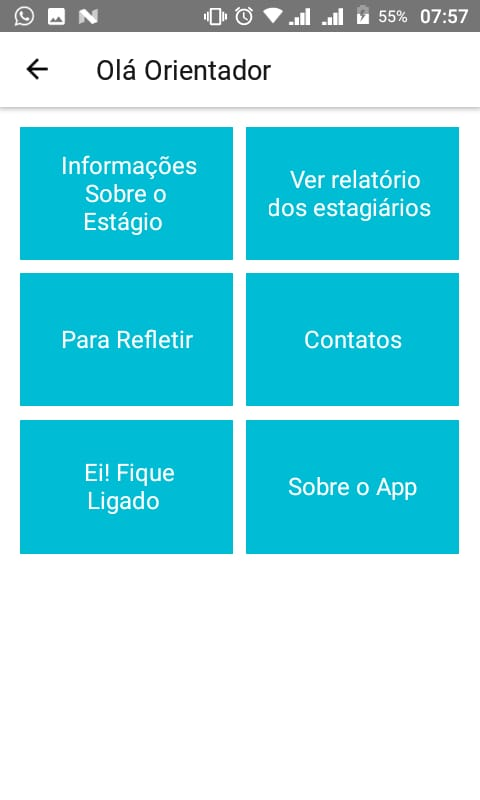
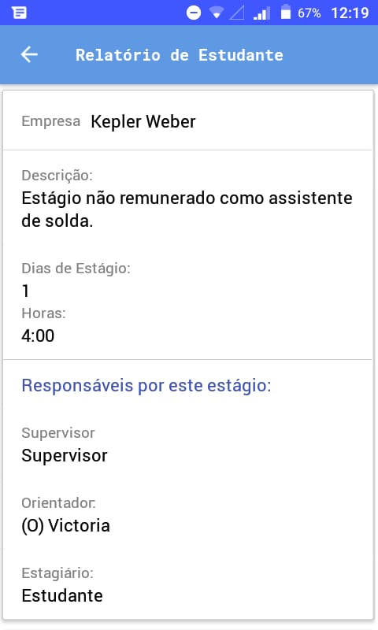

  

> Repositório destinado ao desenvolvimento do aplicativo Estágio Integrado desenvolvido durante o mestrado da Me. Josiana Bazana

> Atenção! O servidor foi desativo mas a aplicação ainda pode ser utilizada. Para isso, basta seguir o [tutorial](https://htmlpreview.github.io/?https://github.com/vyk1/projetoEi/blob/master/releases/index.html)

<h2 id="pattern"> 🖼️ Imagens do Projeto </h2>
 

<h2 align="center">Aplicação Cliente (Mobile)</h2>
 
<h4> ⚙️ Funcionalidades </h4>

- Todos
  - Consultar lei de estágio
  - Consultar dicas para estágio

- Aluno
  - Cadastrar relatório de atividades
    - Inserir texto
    - Inserir imagens
    - Inserir hora de entrada e saída

- Orientador/Supervisor
  - Ver alunos orientados
  - Ver relatórios de atividades dos alunos
  - Ver relatórios de frequência dos alunos
    - Ver horários de entrada e saída dos alunos

<h4> 🔨 Tecnologias</h4>

* React-native
* Expo

 
<h1 align="center">

</h1>

<h2 align="center">Aplicação Web (admin)</h2>
 
<h4> ⚙️ Funcionalidades </h4>

- Cadastrar usuário (aluno, orientador, supervisor)
- Apagar usuários
- Editar usuários

<h4> 🔨 Tecnologias</h4>

* Node.js
* React.js
* MongoDb

 
<h1 align="center">

## Tutorial?
Clique [aqui](https://htmlpreview.github.io/?https://github.com/vyk1/projetoEi/blob/master/releases/index.html)

## 🤝 Equipe
  
| Josiana Rita Bazana | Victoria Botelho Martins |
|--|--|
| PO | Desenvolvedora |

''
## Contatos

Josiana Rita Bazana - josiana.bazana@iffarroupilha.edu.br

Victoria Botelho Martins - [@vyk1](https://github.com/vyk1)

## Agradecimentos

* [IFFar](https://IFFar.br/)

[⬆ Voltar ao topo](#topo) 

## Licença

Shield : [![CC BY-NC-SA 3.0][cc-by-nc-sa-shield]][cc-by-nc-sa]

Esta obra tem a [licença Creative Commons Atribuição-NãoComercial-CompartilhaIgual 3.0 Internacional][cc-by-nc-sa].

[![CC BY-NC-SA 3.0][cc-by-nc-sa-image]][cc-by-nc-sa]

[cc-by-nc-sa]: https://creativecommons.org/licenses/by-nc-sa/3.0/deed.pt_BR
[cc-by-nc-sa-image]: https://licensebuttons.net/l/by-nc-sa/3.0/88x31.png
[cc-by-nc-sa-shield]: https://img.shields.io/badge/License-CC%20BY--NC--SA%203.0-lightgrey.svg
